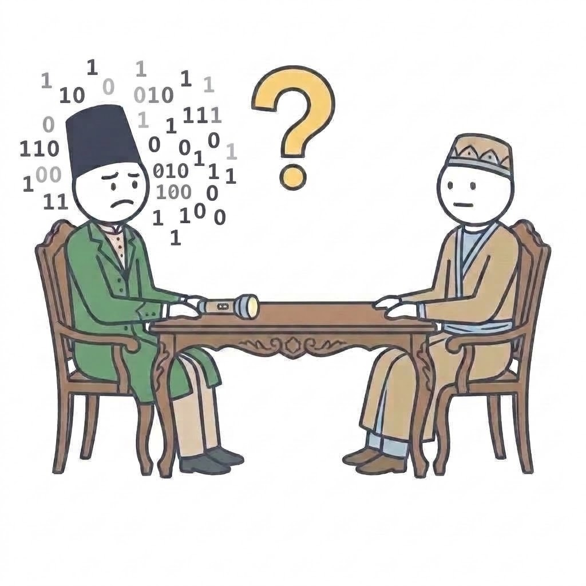

یه داستان کوتاه…

فرض کنین قراره برای دوستتون بیت‌های **Y = 01011001** یا **N = 01001110** رو بفرستین، اما نمیتونین از روش‌های بدیهی مثل صحبت کردن یا نوشتن استفاده کنین. &#x20;

## مأموریت شما

دست به‌کار بشین و با بهره‌گیری از امکانات محدود اطرافتون (مثلا فلش‌لایت گوشی، ضربه رو میز یا هر کلک دیگه‌ای) داده‌ها رو برای یکی از اعضای گروهتون ارسال کنین…

دقت کنین که گیرنده باید متوجه بشه که بیت‌های ارسالی معادل کدوم حرف بود. (Y/N)

بعد از اینکه ماموریتتون با موفقیت به پایان رسید، به این سه سؤال جواب بدین:

1. صفر و یک‌ها به چی تبدیل شدن تا به دست دوستت برسن؟
2. داده از چه‌ محیط فیزیکی‌ای عبورکرد؟&#x20;
3. قبل از ارسال داده‌ها چه قراری با هم گذاشتین تا دوستتون بفهمه الان «یک» داره دریافت می‌کنه یا «صفر» ؟
