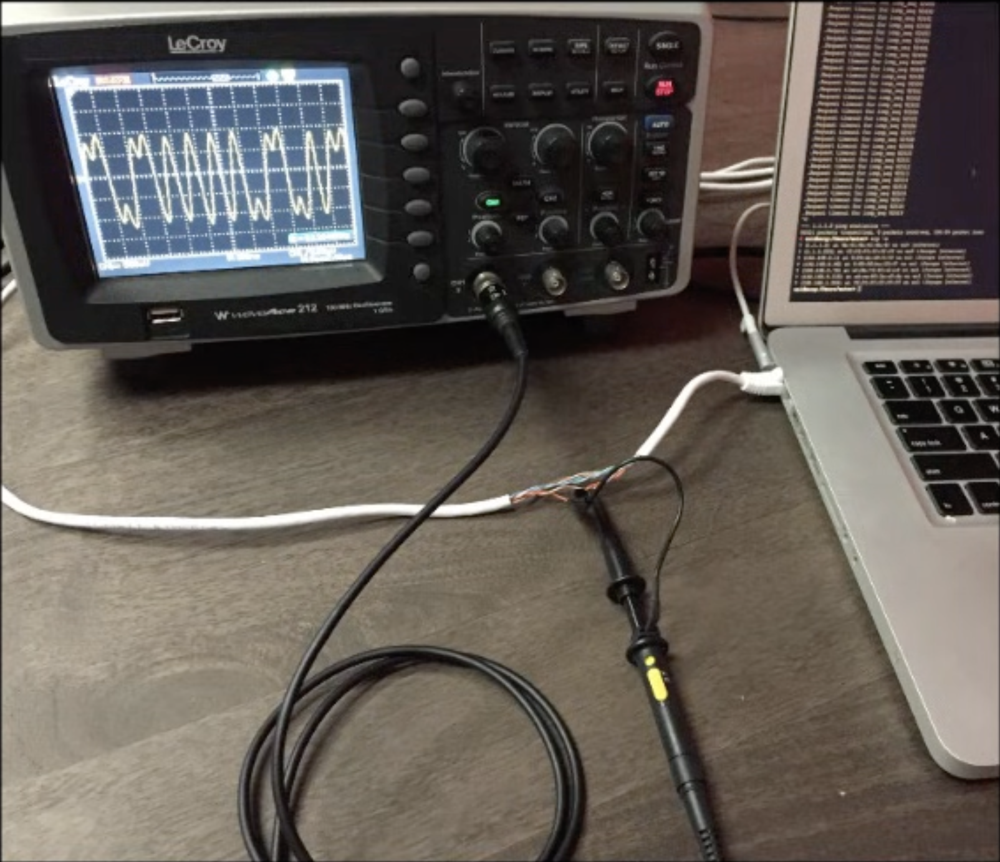

کامپیوتر شما این دادهٔ باینری رو در اختیار داره:

10110111

دوستتون چند متر اون‌طرف‌تر منتظره این داده رو دریافت کنه؛ اما نمی‌تونین صفحهٔ کامپیوتر رو بهش نشون بدین، عددها رو صدا بزنین یا پیام رو روی کاغذ بنویسین. چجوری می‌تونین این صفر و یک‌ها رو براش بفرستین؟در مرحله بعد دوستتون چندتا خونه اون طرف تره، حالا چجوری براش میفرستین؟(و حتی در مرحله بعد مطرح کنیم که اگه یه شهر دیگه باشه چیکار کنیم؟)

\[تصویر: دو نفر کنار دو کامپیوتر جدا از هم. روی صفحهٔ کامپیوتر اول پیام 10110111 دیده می‌شود و صفحهٔ کامپیوتر دوم خالی است.]

صفر و یک‌ها نمی‌تونن خودشون فاصلهٔ بین دو کامپیوتر رو طی کنن. برای انتقالشون باید از یک چیز فیزیکی کمک بگیرین؛ چیزی که از فرستنده تا گیرنده ادامه پیدا کنه و گیرنده بتونه تغییراتش رو تشخیص بده.

## مأموریت شما

یک روش برای فرستادن دادهٔ 10110111 به دوستتون پیشنهاد بدین.

در پیشنهادتون مشخص کنین:

1. داده از چه راهی فاصلهٔ بین شما و دوستتون رو طی می‌کنه؟
2. چه چیزی در این مسیر تغییر می‌کنه؟
3. دوستتون چجوری از روی این تغییرها صفر و یک‌ها رو تشخیص می‌ده؟

روش شما باید دو حالت متفاوت و قابل‌تشخیص برای نمایش صفر و یک داشته باشه. وقتی به یک پیشنهاد رسیدین، اون رو برای منتور توضیح بدین.

### حالا فقط یک سیم دارین

حالا فرض کنید فاصله مون همون چند متره و یه سیم داریم. سیم را بین دو کامپیوتر قرار می‌دیم. خود عددهای صفر و یک نمی‌تونن وارد سیم بشن. باید چیزی رو داخل سیم تغییر بدین که فرستنده بتونه کنترلش کنه و گیرنده بتونه اندازه بگیردش.فکر می‌کنین داخل سیم چه چیزی رو می‌شه تغییر داد؟



\[تصویر: دو کامپیوتر که با یک سیم به هم متصل شده‌اند. روی سیم هنوز هیچ صفر، یک یا جهت مشخصی نمایش داده نشده است.]

### آماده‌این؟

وقتی یک راه انتقال پیشنهاد دادین و تونستین پیام باینری رو با تغییر ولتاژ بدون خطا منتقل کنین، منتورتون رو صدا بزنین. آماده باشین بگین داده از چه مدیومی عبور کرد، چه چیزی داخل سیم تغییر کرد و قرارداد صفر و یک شما چی بود.
