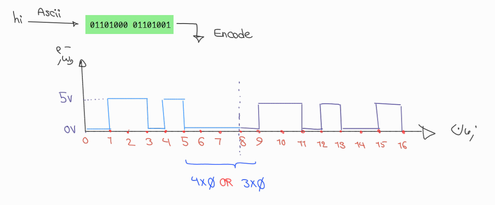

## کارتِ تقلب منتور

### مسیر گام در یک نگاه

تبدیل حروف به باینری ← رسم سیگنال ولتاژ برحسب زمان براساس داده‌باینری ← کشف قانون زمانی(سنکرونیزه کردن کلاک)

### جواب‌های مأموریت باید شامل چه نکات کلیدی‌ای باشن؟

باید شکل سیگنال رو مثل زیر بکشن | منتور باید سعی کنه یه جایی زیادی صفر/یک بخونه تا بچه بفهمه باید کلاک رو با گیرنده هماهنگ کنه

### زمان مورد انتظار

حدود ۱۰ دقیقه
