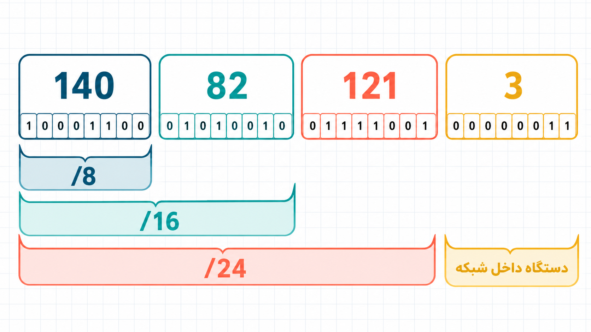

توی گام‌های قبل، وقتی یه کامپیوتر می‌خواست برای کامپیوتر دیگه‌ای بسته بفرسته، شمارهٔ فرستنده و گیرنده رو روی بسته می‌نوشتیم؛ مثلاً:

از کامپیوتر ۱، به کامپیوتر ۶

این شماره توی همون شبکه، شناسهٔ کامپیوتر بود. برای یه شبکهٔ کوچیک این روش خوب جواب می‌ده، اما اینترنت از تعداد خیلی زیادی شبکه و میلیاردها دستگاه ساخته شده. اینجا «کامپیوتر ۶» دیگه کافی نیست. کامپیوتر ۶ توی کدوم شبکه‌ست؟ کدوم شهر یا کشوره؟

پس توی اینترنت به شناسه‌ای نیاز داریم که فقط یه شمارهٔ ساده نباشه؛ باید به پیدا کردن جای دستگاه هم کمک کنه. به همچین شناسه‌ای می‌گیم آدرس.

### بسته‌ها هم آدرس فرستنده و گیرنده دارن

یه بستهٔ اینترنتی رو مثل یه پاکت نامه تصور کنین. روی پاکت، آدرس فرستنده و گیرنده نوشته می‌شه. مرکزهای پستی هم در هر مرحله آدرس مقصد رو نگاه می‌کنن و نامه رو به مسیر مناسب می‌فرستن.

روترها هم کار مشابهی انجام می‌دن: آدرس مبدأ و مقصد داخل بسته نوشته می‌شه و هر روتر با دیدن آدرس مقصد، مسیر بعدی رو انتخاب می‌کنه. اما چطور چندتا عدد نقش آدرس رو بازی می‌کنن؟

### کدوم پاریس؟

فرض کنین می‌خواین برای دوستتون «سارا» که در پاریس زندگی می‌کنه نامه بفرستین و شروع می‌کنین به نوشتن آدرس گیرنده:

پاریس، ...

اما یه مشکل داریم: شهر پاریس فقط توی فرانسه نیست؛ توی ایالت تگزاسِ آمریکا هم شهری به همین اسم وجود داره! پس هنوز معلوم نیست نامه باید به پاریسِ فرانسه بره یا از اقیانوس اطلس رد بشه و به پاریسِ تگزاس برسه. برای این‌که از همون اول مسیر اشتباه نشه، باید بخش بزرگ‌تر آدرس، یعنی کشور، مشخص باشه.

حالا فرض کنین سارا در پاریسِ فرانسه، خیابون ریولی و پلاک ۱۲ زندگی می‌کنه. مدتی بعد دوست دیگه‌تون، «آرین»، هم به همون شهر و همون خیابون می‌ره، ولی در ساختمان کناری، پلاک ۱۴، ساکن می‌شه. آدرس‌هاشون رو با هم مقایسه کنیم:

1. فرانسه، منطقهٔ ایل-دو-فرانس، شهر Paris، خیابون ریولی، پلاک ۱۲
2. فرانسه، منطقهٔ ایل-دو-فرانس، شهر Paris، خیابون ریولی، پلاک ۱۴

تقریباً کل آدرس این دو نفر یکیه و فقط پلاک فرق می‌کنه. تا وقتی نامه‌ها به فرانسه نرسیدن، همین که معلوم باشه هر دو باید به فرانسه برن کافیه. داخل فرانسه، منطقهٔ ایل-دو-فرانس مهم می‌شه؛ بعد شهر پاریس؛ و وقتی نامه‌ها به خیابون ریولی رسیدن، تازه تفاوت پلاک‌های ۱۲ و ۱۴ به کار میاد. هر بخش از آدرس، مقصد رو از یه محدودهٔ بزرگ به یه جای کوچیک‌تر و دقیق‌تر می‌رسونه.

ادارهٔ پستِ تهران لازم نیست جای دقیق پلاک ۱۲ یا ۱۴ رو در دنیا بلد باشه؛ تنها چیزی که براش مهمه اینه که این نامه باید از کشور خارج بشه و به فرانسه بره. بنابراین تنها چیزی که باید مشخص کنه اینه که با توجه به تیکه اول آدرس ("فرانسه") مرکز پستی بعدی‌ای که نامه باید به اون فرستاده بشه کجاست.

### آدرس IP

توی اینترنت هم از ایده‌ای شبیه همین استفاده می‌کنیم. هر دستگاه یه آدرس IP داره. احتمالاً قبلاً چیزی شبیه این دیدین:

`140.82.121.3`

این یه آدرس IP ئه (به طور خاص آدرس IP version 4)؛ یه عدد ۳۲ بیتی که برای راحت‌تر خونده‌شدن به چهار بخش تقسیمش می‌کنیم. هر بخش ۸ بیت داره و می‌تونه عددی بین ۰ تا ۲۵۵ باشه.

اما آدرس IP فقط یه عدد یا شمارهٔ شانسی نیست؛ واقعاً نقش یه آدرس رو بازی می‌کنه. توی آدرس خونهٔ سارا، پیشوند «فرانسه» کشور مقصد رو از بین همهٔ کشورهای دنیا مشخص می‌کرد. پیشوند «فرانسه، منطقهٔ ایل-دو-فرانس، شهر پاریس» شهر مقصد رو از بین همهٔ شهرهای دنیا مشخص می‌کرد. با اضافه‌شدن «خیابون ریولی» هم جای محله مقصد از بین تمام محله‌های دنیا مشخص میشه.

بخش‌های ابتدایی آدرس IP هم تقریباً همین کار رو برای شبکه‌ها انجام می‌دن. در آدرس `140.82.121.3`، عدد `140` یه شبکهٔ بزرگ از آدرس‌ها رو مشخص می‌کنه. `140.82` شبکهٔ کوچک‌تری داخل همون شبکه‌ست و `140.82.121` باز هم محدوده رو کوچک‌تر و دقیق‌تر می‌کنه. کامپیوتر مقصد داخل همهٔ این محدوده‌ها یا به طور دقیق‌تر، شبکه‌های تودرتو قرار گرفته؛ درست مثل خونهٔ سارا که هم در فرانسه‌ست، هم در ایل-دو-فرانس، هم در پاریس و هم در خیابون ریولی.

برای نشون‌دادن این پیشوندها، از یه نشانه‌گذاری کوتاه استفاده می‌کنن:

1. `140.0.0.0/8`
2. `140.82.0.0/16`
3. `140.82.121.0/24`

عدد بعد از / می‌گه چند بیت اول آدرس جزو پیشونده. پس /8 یعنی ۸ بیت اول یا همون بخش `140`؛ /16 یعنی ۱۶ بیت اول یا `140.82`؛ و /24 یعنی ۲۴ بیت اول یا `140.82.121`. هرچی تعداد بیت‌های پیشوند بیشتر می‌شه، شبکه‌ای که مشخص می‌کنیم کوچک‌تر و دقیق‌تر می‌شه. در شبکهٔ `140.82.121.0/24`، ۸ بیت آخر آدرس کمک می‌کنه دستگاه شمارهٔ 3 رو داخل همون شبکه پیدا کنیم.

بنابراین آدرس IP دو کار مهم انجام می‌ده: هم دستگاه مقصد رو مشخص می‌کنه، هم به روترها سرنخ می‌ده که برای رسیدن به شبکهٔ اون دستگاه، بسته رو به کدوم سمت هدایت کنن.
