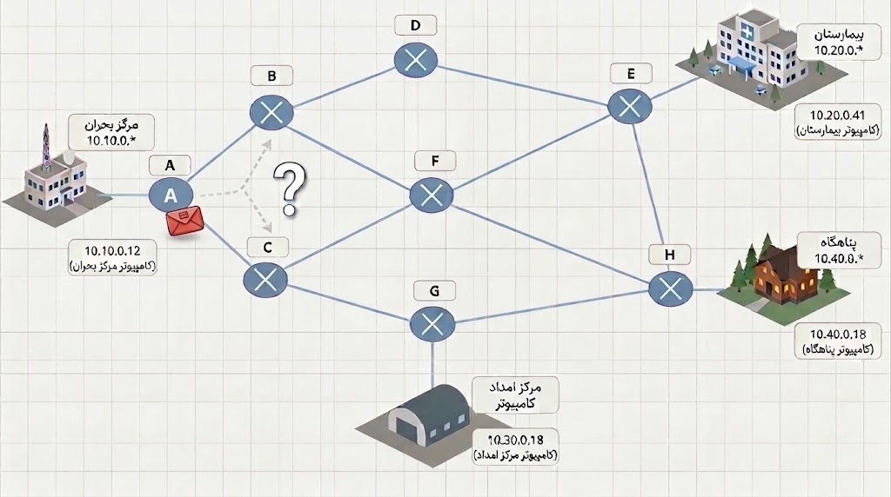

یک کامپیوتر در مرکز بحران با آدرس `10.10.0.12` میخواد بسته‌ای برای سرور بیمارستان با آدرس `10.20.0.8` بفرسته. این دو تا دستگاه توی دو شبکه متفاوت هستن و مستقیما به هم دسترسی ندارن. بینشون دستگاهی قرار گرفته که چند تا مسیر خروجی داره.&#x20;

حالا وقتشه بررسی کنیم وقتی یه بسته به این دستگاه میرسه از کدوم مسیر باید خارج بشه.&#x20;

دستگاهی که شبکه‌های متفاوت را به هم متصل می‌کنه و بسته را به سمت یک شبکه دیگه می‌فرسته، «روتر» هست.

## مأموریت شما

برای روتر A یک راهنمای کوتاه و قابل اجرا بنویسین تا وقتی بسته‌ای وارد روتر شد روتر بر اساس اون بفهمه باید چیکار کنه

راهنماتون باید برای بسته‌هایی با این مقصدها کار کنه:

1. یک دستگاه در شبکه بیمارستان: `10.20.0.41`
2. یک دستگاه در شبکه مرکز امداد: `10.30.0.18`
3. یک دستگاه در شبکه پناهگاه: `10.40.0.18`

روتر A در هر تصمیم فقط می‌تونه بسته را از سیم متصل به روتر B، سیم متصل به C، یا هر دو سیم و حتی به سمت مرکز بحران بازارسال کنه

شکل راهنما رو خودتون انتخاب کنین :) میتونید از جدول، نمودار، کارت یا مجموعه‌ای از قانون‌ها استفاده کنید. مهم اینه که اگر راهنماتون رو دادیم به یه گروه دیگه بتونه بدون توضیح اضافه ازش استفاده کنه.

**بعد از نوشتن راهنما به این سوالا پاسخ بدین:**

- اگر کامپیوتر‌های `10.20.0.41` و `10.20.0.93` به سرور بیمارستان اضافه بشن، آیا راهنمای شما به درستی برای این مقصد‌ها کار می‌کنه؟
- اگر سرور بیمارستان پاسخی برای یک کامپیوتر در مرکز بحران به آدرس `10.10.0.27` بفرسته، راهنمای شما با این بسته چه رفتاری خواهد داشت؟
- راهنمای شما با بسته‌ای به مقصد `123.4.5.4` چه کاری می‌کنه؟

### آماده‌این؟

وقتی راهنماتون برای هر سه شبکه‌ی مقصد و IP های جدید کار کرد، منتور رو صدا کنید.&#x20;

آماده باشید که :&#x20;

1. ساز و کار راهنماتون رو توضیح بدین
2. یک بسته جدید رو با استفاده از راهنما هدایت کنین
