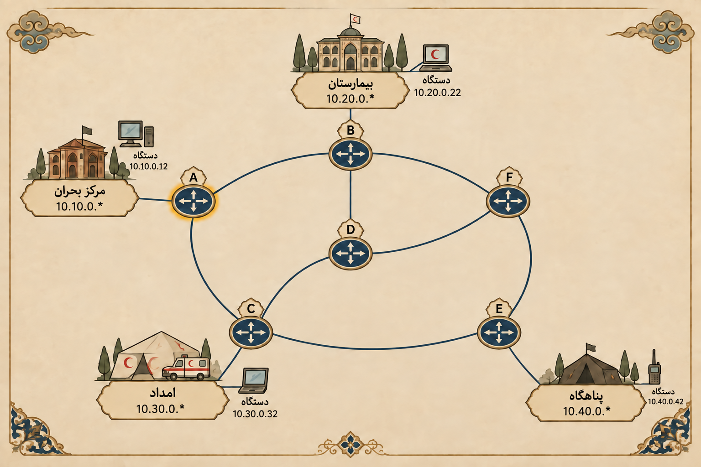

راهنمای روتر A آماده شده؛ اما شبکه فقط یه روتر نداره.

ممکنه یه بسته توی A تصمیم درستی بگیره، به C برسه و اونجا دوباره با چند مسیر مختلف روبه‌رو بشه. اگه C ندونه قدم بعدی چیه، راهنمای مربوط به  A به‌تنهایی نمی‌تونه بسته رو به مقصد برسونه.

توی این گام، میخوایم جدول مسیریابی همه روترها رو تکمیل کنیم تا هر بسته از **بهترین مسیر ممکن به مقصدش** برسه.

## مأموریت شما

- در شبکه بالا دو مسیر مختلف از مرکز بحران تا پناهگاه رو در نظر بگیرید. کدوم یک از این مسیر‌ها مسیر بهتری هستند؟ چرا؟ اصلا معیار بهتر بودن یک مسیر چیه؟

* در بازی پایین، قبل از فرستادن بسته‌ها، همهٔ روترهای شبکه رو آماده کنین. یعنی برای هر کدوم از اون‌ها جدول مسیریابی رو کامل کنید.

جدول‌هاتون باید طوری با هم هماهنگ باشن که بسته:

1. به بن‌بست نرسه.
2. وارد حلقه نشه. (تا ابد در شبکه باقی نمونه)
3. بهترین مسیر رو انتخاب کنه.
4. در نهایت به شبکهٔ مقصد برسه.

<iframe class="mini-game" src="../../games/routing/basic/index.html" title="مینی‌گیم پر کردن جداول مسیریابی" loading="lazy" allowfullscreen></iframe>

### آماده‌این؟

وقتی جدول همهٔ روترها رو کامل کردین و بستهٔ آزمایشی بدون حلقه و بن‌بست به مقصد رسید، منتورتون رو صدا کنین.

آماده باشین که:

1. معیار انتخاب بین دو مسیر رو توضیح بدین.
2. توضیح بدین که با چه منطقی جداول مسیریابی رو پر کردین.
