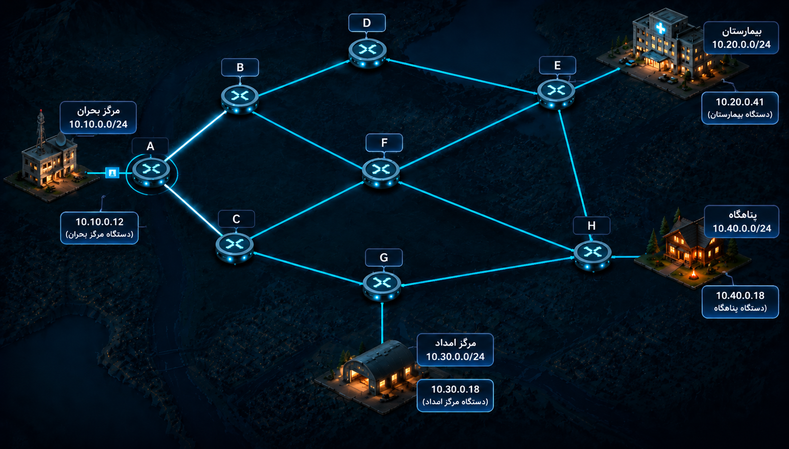

راهنمای(جدول مسیریابی)  روتر A آماده شده؛ اما شبکه فقط یه روتر نداره.

ممکنه یه بسته توی A تصمیم درستی بگیره، به C برسه و اونجا دوباره با چند مسیر مختلف روبه‌رو بشه. اگه C ندونه قدم بعدی چیه، جدول مسیریابی مربوط به  A به‌تنهایی نمی‌تونه بسته رو به مقصد برسونه.

توی این گام، میخوایم جدول مسیریابی همه روترها رو تکمیل کنیم تا هر بسته از **بهترین مسیر ممکن به مقصدش** برسه.

## مسیر بهتر چه مسیریه؟

هر اتصال بین دو روتر یه واحد هزینه داره. پس توی این فعالیت، Cost (هزینه) همون تعداد Hop (پرش) هاییه که بسته بین روترها طی می‌کنه.

اگه شبکهٔ مقصد مستقیماً به یه روتر وصل باشه، اون مقصد برای اون روتر «مستقیم» حساب می‌شه و دیگه لازم نیست یه روتر واسطه انتخاب کنه. بنابراین هزینه انتقال بسته به شبکه‌ای که مستقیما وصله به روتر، کمترین هزینه ممکن و برابر با ۱ ئه.

قبل از پرکردن جدول‌ها، مشخص کنین که با چه معیاری یه مسیر رو بهتر از مسیر دیگه می‌دونین.

توی این مأموریت، معیار اصلی تعداد Hopهاست:

**هر بار که بسته از یه دستگاه به دستگاه بعدی تحویل داده می‌شه، یه Hop حساب می‌کنیم.**

اگه دو مسیر تعداد Hop مساوی داشته باشن، هر دو می‌تونن انتخاب‌های مناسبی باشن. فقط باید مطمئن بشین که انتخاب روترها در کنار همدیگه حلقه درست نمی‌کنه.

## مأموریت شما

قبل از فرستادن بسته‌ها، همهٔ روترهای شبکه رو آماده کنین؛

شما:

1. نقشهٔ کامل شبکه رو می‌بینین.
2. همهٔ اتصال‌ها سالم‌ان.
3. شکل شبکه در طول مأموریت تغییر نمی‌کنه.
4. هر روتر فقط می‌تونه بسته رو به یکی از همسایه‌های مستقیم خودش تحویل بده.

برای هر روتر این کار رو انجام بدین:

1. یه روتر رو انتخاب می‌کنین.
2. Destination Prefix رو انتخاب می‌کنین.
3. یکی از همسایه‌های مستقیم رو به‌عنوان قدم بعدی (یا اصطلاحاً Next Hop) انتخاب می‌کنین.

جدول‌هاتون باید طوری با هم هماهنگ باشن که بسته:

1. به بن‌بست نرسه.
2. وارد حلقه نشه.
3. بی‌دلیل مسیر طولانی‌تری رو طی نکنه.
4. در نهایت به شبکهٔ مقصد برسه.

<iframe class="mini-game" src="../../games/routing/index.html" title="مینی‌گیم پر کردن جداول مسیریابی" loading="lazy" allowfullscreen></iframe>

### آماده‌این؟

وقتی جدول همهٔ روترها رو کامل کردین و بستهٔ آزمایشی بدون حلقه و بن‌بست به مقصد رسید، منتورتون رو صدا کنین.

آماده باشین که:

1. معیار انتخاب مسیرتون رو توضیح بدین.
2. جدول یکی از روترها رو معرفی کنین.
3. توضیح بدین که برای ساختن این جدول‌ها از چه اطلاعاتی دربارهٔ نقشه استفاده کردین.
