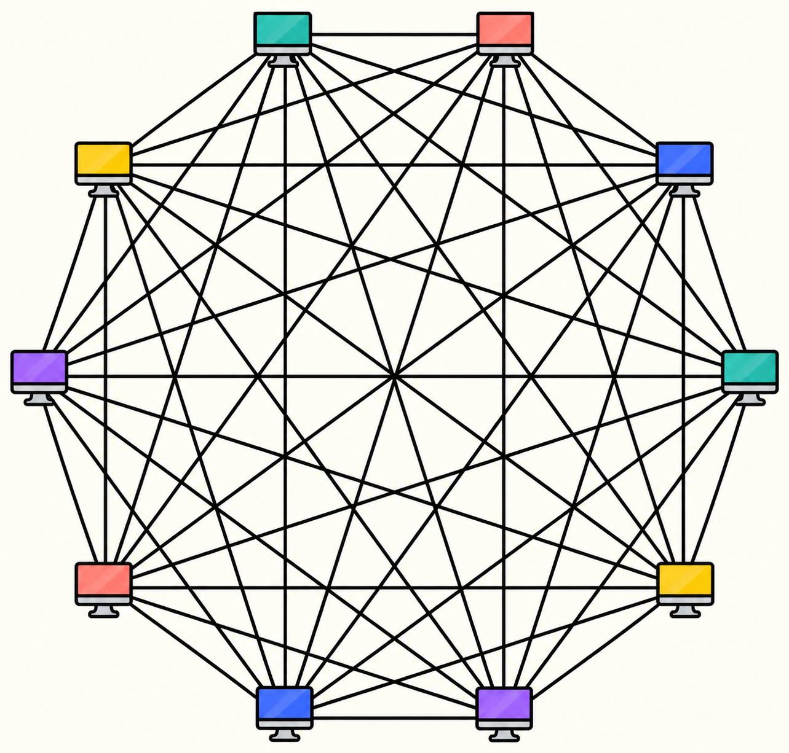

فهمیدیم که وقتی دو کامپیوتر رو مستقیماً به هم با سیم وصل کنیم، میتونن ۰ و ۱ ها رو روی سیم برای همدیگه بفرستن. ولی کلی کامپیوتر دیگه هم هستن که دوست داریم با اون‌ها ارتباط برقرار کنیم.وقتی فقط ۲ کامپیوتر داشتیم، یه سیم بین‌شون می‌کشیدیم و تمام. اما فرض کنید **۱۰** تا کامپیوتر داریم که دوست داریم هر کدوم خواست بتونه با اون یکی ارتباط برقرار کنه.

یه راه اینه که هر کامپیوتر رو با سیم به تمام کامپیوترهای دیگه وصل کنیم، اما این روش خیلی زود به مشکل میخوره؛ برای ۱۰ تا کامپیوتر نیاز به ۴۵ تا سیم خواهیم داشت! تازه هر کامپیوتر هم باید قابلیت اینو داشته باشه که ۹ تا سیم بهش وصل بشه!!

تازه اگه کامپیوترهامون رو دو برابر کنیم و بکنیمشون ۲۰ تا، تعداد سیم‌ها بیش از ۴ برابر میشه و به ۱۹۰ می‌رسه!!

در حالی که غرق فکرید، نگاهتون به نقشه ایران می‌افته و ناگهان متوجه یه نکته‌ای میشید؛ از هر شهر ایران میشه به اون یکی شهر رفت، اما این بدین معنی نیست که بین تمام شهرها یه جاده مستقیم وجود داره…

## مأموریت شما

برای برقراری ارتباط بین ۱۰ تا کامپیوتر، یه راه‌حلی ارائه بدین که نیاز به تعداد سیم‌های خیلی کمتری داشته باشه. نحوه اتصال کامپیوترها به همدیگه رو روی کاغذ بکشید و تعداد سیم‌ها رو بشمرید.
