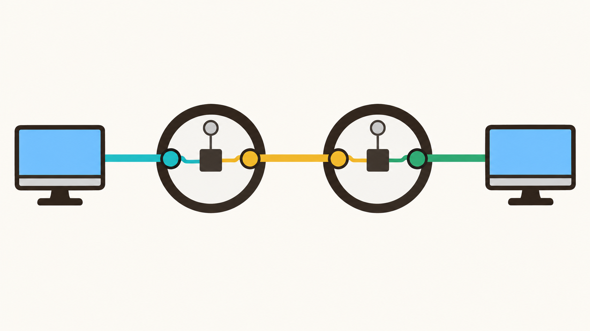

بعد از اینکه ایده یه دستگاه میانی به اسم سوئیچ به ذهنتون رسید، رستاالملک رفت نشست و فکر کرد به اینکه داخل چنین دستگاهی احتمالاً چه خبره. تا اینکه یه همچین ایده‌ای به ذهنش رسید:

<iframe class="mini-game" src="../../games/switch/index.html" title="مینی‌گیم سوییچ" loading="lazy" allowfullscreen></iframe>

داخل سوییچ یه مداری داریم، که می‌تونه هر دو سیم ورودی-خروجی ای که بخوایم رو به هم وصل کنه. وقتی دوتا کامپیوتر میخوان برای هم داده بفرستن، سوئیچ ورودی-خروجی مربوط به اون‌ها رو به هم وصل می‌کنه. با انجام این کار، دقیقا مثل این می‌مونه که این دو تا کامپیوتر، مستقیماً توسط یه سیم به هم وصل باشن!

حتی میشه دو سوییچ رو مستقیم به هم وصل کرد! اینطوری تعداد کامپیوترهای خیلی بیشتری رو میشه به هم مرتبط کنیم. اما طبعاً لازمه که برای وصل شدن دو تا کامپیوتر که به سوییچ‌های یکسانی وصل نیستن، هر دو سوییچ رو تنظیم کنیم:

نکته مهم اینه که به خاطر ساختار سوئیچ، تا موقعی که ارتباط اون دوتا کامپیوتر برقراره، **امکانش نیست** که اون ورودی-خروجی‌ها و سیم‌هاشون توسط کامپیوترهای دیگه استفاده بشن.

رستاالملک پس از این اختراع، تصمیم گرفت اون را در شهرهای مختلف به کار بگیره. برای همین ۴ تا از این سوییچ ساخت و دستگاه‌های فرستنده و گیرنده رو در ۶ شهر پخش کرد.

با عنایت همایونی، تونستن سیم‌های مرغوبی هم بخرن و شبکه‌شون رو آماده کردن.

اما کار اصلی تازه از اینجا آغاز شد؛ اعضای جمعیت باید اخبار مهمی که در شهرهای مختلف به دست می‌آوردن رو برای یکدیگر می‌فرستادن. پس باید یاد می‌گرفتن چطوری با یک شهر دیگه ارتباط برقرار کنن…

## مأموریت شما

در مینی‌گیم زیر با استفاده از سوییچ‌ها، ارتباط‌ها رو به سرعت برقرار کنید، تا پیام‌ها که حاوی اخبار مهمی هستن، به موقع به مقصدشون برسن.

(نکته: منظورمون از **پیام**، تعدادی صفر و یکه؛ مثلا وقتی میخوایم متن «Hey» رو برای دوستمون بفرستیم، اول اون رو به «01001000 01100101 01111001» تبدیل می‌کنیم تا بشه ۲۴ بیت، و بعد می‌فرستیمش.)

<iframe class="mini-game" src="../../games/circuit-switching/index.html" title="مینی‌گیم circuit switching" loading="lazy" allowfullscreen></iframe>

بعد از اینکه بازی کردین، به سؤال‌های زیر جواب بدین؛

- چندتا از درخواست‌هایی که نتونستین انجامشون بدین رو بررسی کنین؛ دقیقاً چرا در رسوندن به موقع پیام‌ها موفق نبودین؟
- آیا بعد از برقراری ارتباط‌ها، سیم‌های مرغوبمون دائماً مشغول بودن و از کل پهنای‌باندشون استفاده می‌شد؟ آیا این اتفاق خوبیه؟
