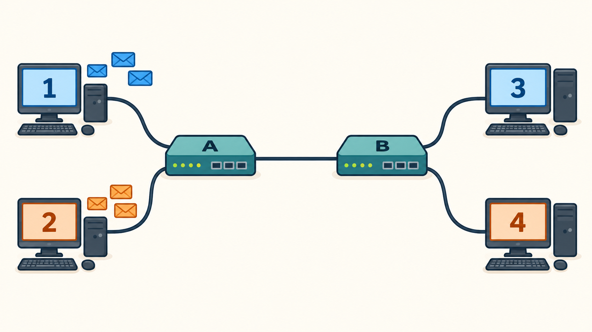

در گام قبل، با نوع خاصی از سوییچ آشنا شدیم و فهمیدیم که اگه از اون در شبکه‌مون استفاده کنیم، مسیر بین هر گیرنده و فرستنده تا آخر ارتباط‌شون رزرو میشه.

حالا بیاید یه سناریو ساده‌تر رو بررسی کنیم؛ در تصویر زیر، کامپیوتر ۱ می‌خواد به کامپیوتر ۳ یک پیام بفرسته. هم‌زمان، کامپیوتر ۲ هم می‌خواد یه پیام **هم‌اندازه** برای کامپیوتر ۴ بفرسته.

اگر از سوییچ‌هایی که در گام قبل داشتیم استفاده کنیم، ارتباط ۱ با ۳ باید مسیر ۱ به A به B به ۳ رو برای مدتی رزرو کنه. ارتباط ۲ با ۴ هم باید مسیر ۲ به A به B به ۴ رو برای مدتی رزرو کنه. از اونجا که اتصال A به B در این دو مسیر مشترکه، پس هر یکی از فرستنده‌ها باید صبر کنه تا رزرو اون یکی تموم بشه و بعد شروع کنه.

با این حساب، اگه انتقال هر پیام روی یک سیم، ۲ ثانیه طول بکشه، هر ارتباط از اول تا آخر ۶ ثانیه طول می‌کشه. چون ارتباط‌ها هم نمی‌تونن همزمان باشن، در کل ۱۲ ثانیه طول می‌کشه تا هر دو پیام به مقصد نهایی‌شون برسن.با خودتون فکر می‌کنین و می‌گین، حتما یه راه بهتری وجود داره… اما تا وقتی که هر ارتباط، کل مسیر رو رزرو می‌کنه، نتیجه از این بهتر نمیشه… تصمیم می‌گیرید از سوییچی که ساختید دیگه استفاده نکنید و برید سراغ یه طرح تازه؛ سوییچی که باعث رزرو مسیر نمیشه…

## مأموریت شما

در مینی‌گیم زیر، کاری کنید که در کمتر ۱۲ ثانیه، هر دو پیام به مقصد هاشون برسن. باید روی هر پیام بزنید تا انتخاب بشه، و بعد دکمه حرکت رو بزنید تا یه قدم بره جلو.

<iframe class="mini-game" src="../../games/packet-split/no-split/index.html" title="مینی‌گیم هدایت پیام‌ها" loading="lazy" allowfullscreen></iframe>

وقتی موفق شدین کمتر از ۱۲ ثانیه پیام‌ها رو برسونین، به سؤال‌های زیر جواب بدین؛

1. دقیقاً چه اتفاقی داره باعث صرفه‌جویی در زمان میشه؟ چرا این اتفاق نمی‌تونست وقتی رزرو رو هنوز داشتیم بیفته؟
2. سوییچ گام قبلی، هر بیتی که بهش وارد می شد حتماً باید همون لحظه خارج می شد، چون توش صرفاً یه سری سیم بود و نمی‌تونست چیزی رو نگه داره. آیا سوییچ جدید شما هم همینطوریه؟ چرا؟
